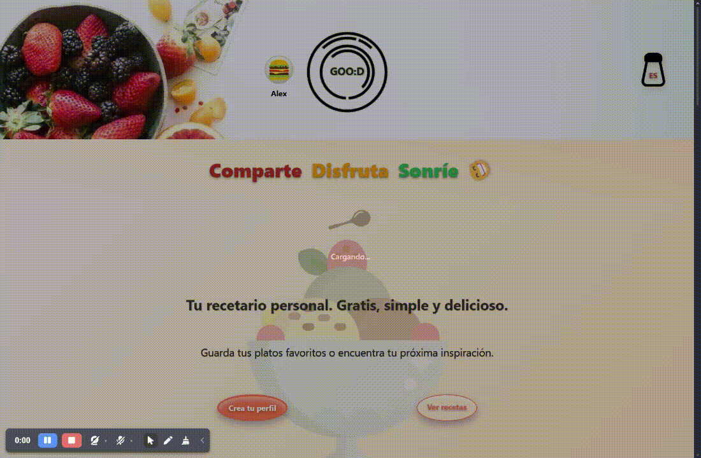

 

<h1 align="center">🍳 GOO:D 🍽️</h1>

---

### 🇪🇸 Español

🎉 **GOO:D** es más que un recetario; es tu compañero para crear, descubrir y compartir platos con pasión y facilidad.  
Animado y cuidadosamente diseñado, combina lo mejor de **Django**, **JavaScript**, **SASS** y librerías modernas como **Quill** y **Select2** para ofrecer una experiencia culinaria única.  

*God! Good! Go!* — Un recetario multilingüe que combina inspiración, calidad y acción para amantes de la cocina.  

Además, GOO:D significa también **Comparte Disfruta Sonríe :D** — porque cocinar es todo eso.

### 🇬🇧 English

🎉 **GOO:D** is more than just a cookbook; it’s your companion to create, discover, and share dishes with passion and ease.  
Playful yet carefully crafted, it blends the power of **Django**, **JavaScript**, **SASS**, and modern libraries like **Quill** and **Select2** to deliver a unique culinary experience.  

*God! Good! Go!* — A multilingual recipe book that brings together inspiration, quality, and action for food lovers.  

And GOO:D also means **Share Enjoy Smile :D** — because cooking is all of that.

 

---

## 📸 Capturas de pantalla  
### Screenshots | Schermate | Captures | Képernyőképek | Capturas

🔹Inicio / Home 🔹 Recetas / Recipes 🔹 Detalle receta / Recipe page🔹

   

| Inicio / Home | Recetas / Recipes | Detalle receta / Recipe page |
|---------------|------------------|-------------------|
|  | 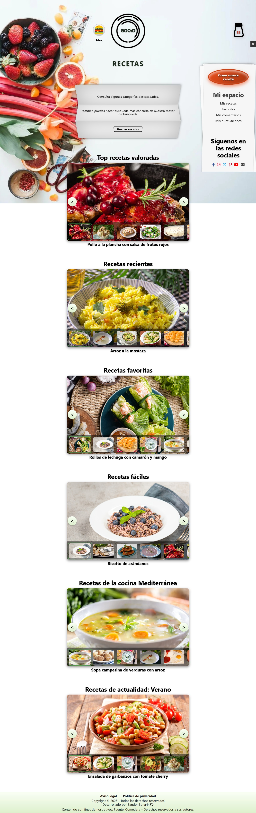 | |

🔸Buscador / Search 🔸 Perfil (datos / data) 🔸 Perfil (recetas / recipes)🔸

   

| Buscador / Search | Perfil / Profile (datos / data) | Perfil / Profile (recetas /recipes) |
|------------------------------|--------------------------|----------------------------|
| 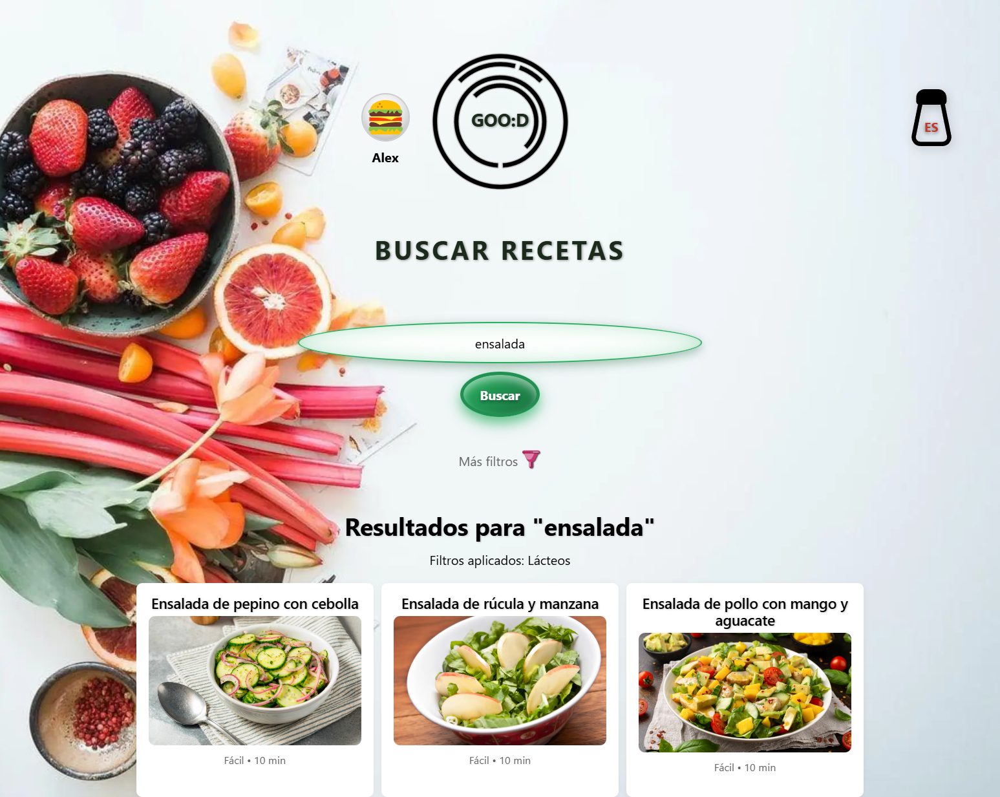  | 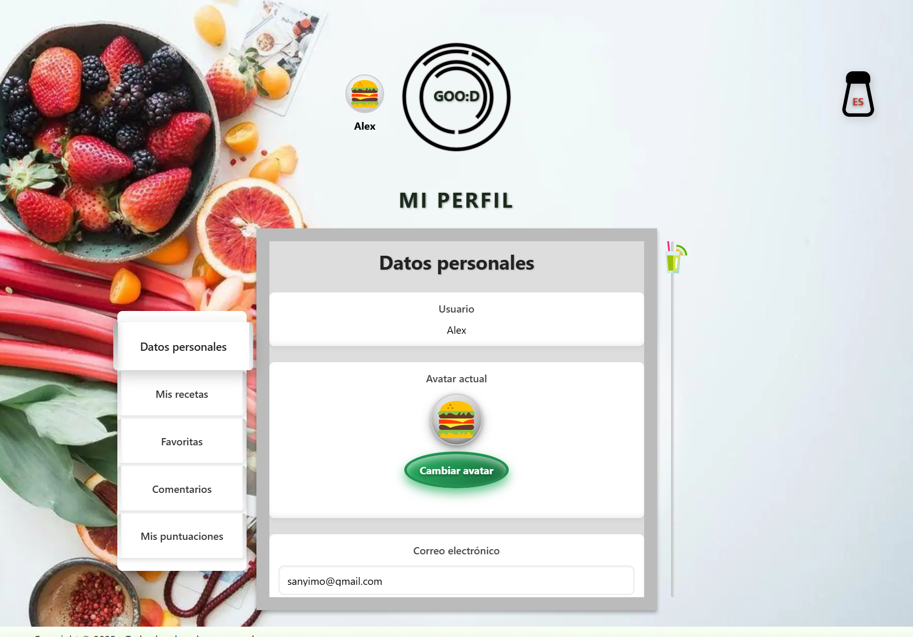 | 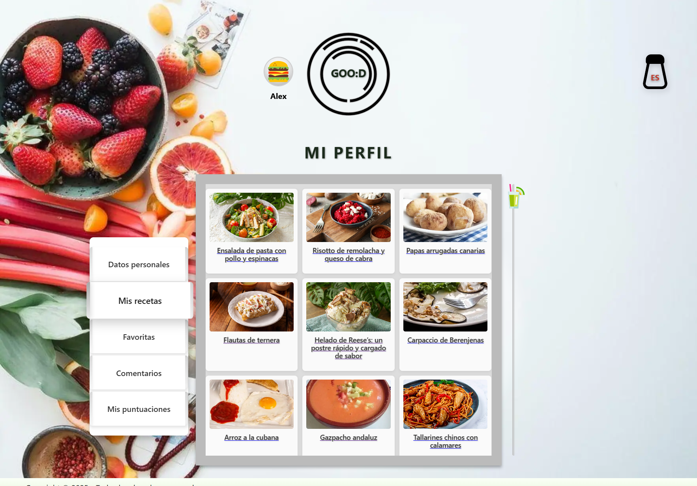 |

🔺Perfil (favoritas / favorites) 🔺 Comentarios / Comments 🔺 Puntuaciones / Rating🔺

   

| Perfil / Profile (favoritas / favorites) | Perfil / Profile (comentarios / comments) | Perfil / Profile (puntuaciones / rating) |
|------------------------------|-------------------------------|---------------------------------|
| 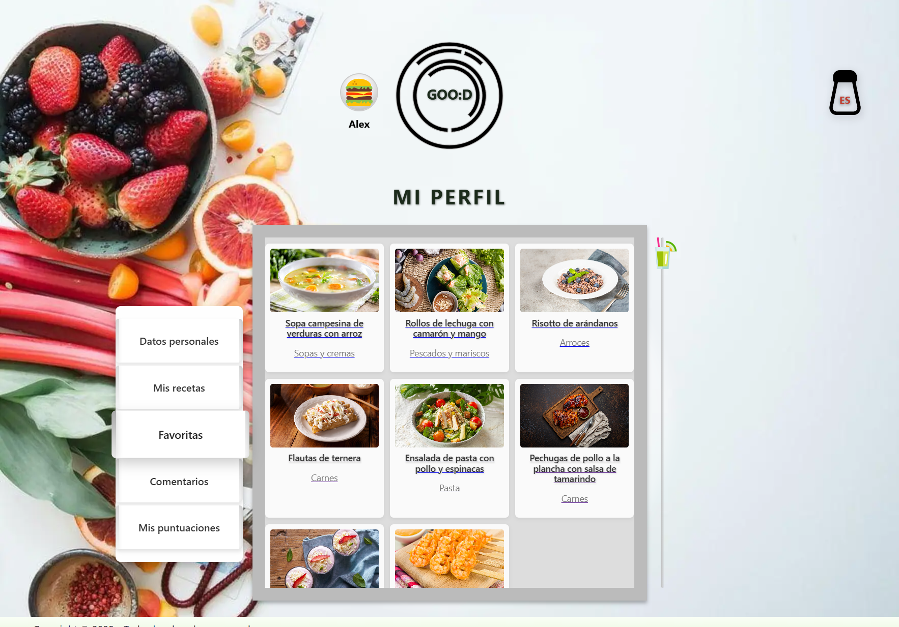 | 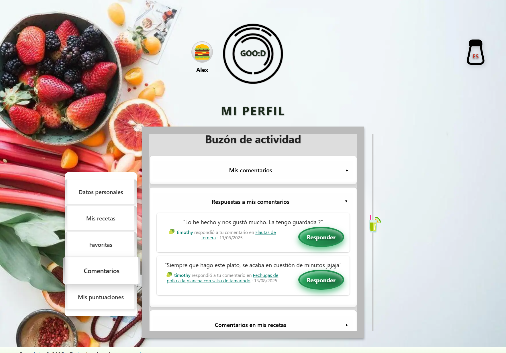 | 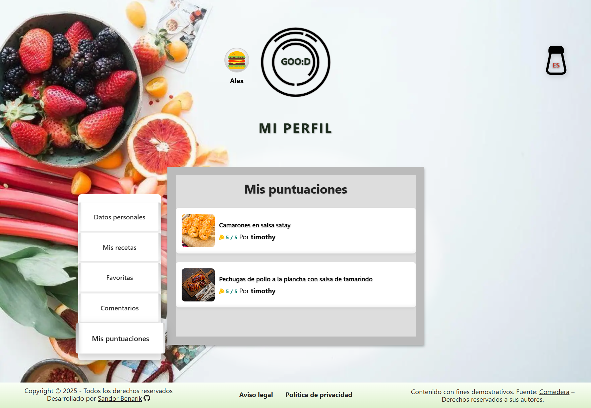 |

   

## 🎥 Demo en vídeo
### Demo video | Demo in video | Demostració en vídeo | Videó bemutató | Demonstração em vídeo

| 🏠 Home | 📋 Recipes | 📖 Recipe page | ✏️ Create / Update form |
|---------|------------|----------------|-------------------------|
| [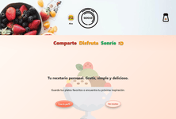](./assets/GOO-D-Inicio1.mp4) | [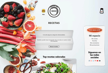](./assets/recipes-list.mp4) | [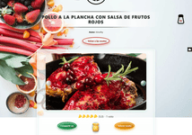](./assets/recipe-page.mp4) | [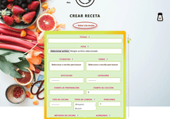](./assets/create-update-form.mp4) |

---
 

🇪🇸 Español

## 🍽️ ¿Qué es GOO:D?

**GOO:D** es una plataforma web para compartir recetas, con soporte multilingüe, diseño responsivo y animaciones cuidadas. Está pensada para usuarios anónimos y registrados, ofreciendo una experiencia rica, visual y funcional.

 

### 🚀 Tecnologías usadas

- **Backend:** Django
- **Frontend:** JavaScript, SASS, AJAX
- **Interfaces ricas:** Quill, Select2 (TinyMCE para administración)
- **Traducción automática:** `LibreTranslate` 

 

### 👥 Funcionalidades por tipo de usuario

| Funcionalidad                                       | Visitantes (sin login) 👫 | Usuarios registrados 🔐 |
|-----------------------------------------------------|---------------------------|--------------------------|
| Ver recetas                                        | ✅                        | ✅                       |
| Búsqueda avanzada con filtros                      | ✅                        | ✅                       |
| Sliders temáticos de recetas                       | ✅                        | ✅                       |
| Sección sorpresa ("¿No sabes qué cocinar?")        | ✅                        | ✅                       |
| Guardar recetas favoritas                          | ❌                        | ✅                       |
| Comentar recetas                                   | ❌                        | ✅                       |
| Puntuar recetas                                    | ❌                        | ✅                       |
| Perfil con avatar y datos                          | ❌                        | ✅                       |
| Subir recetas (convertirse en autor)               | ❌                        | ✅                       |
| Editar / borrar recetas propias                    | ❌                        | ✅ (solo autores)        |

 

### 🛠️ Administración
- Panel de Django Admin completo.
- Gestión de usuarios, recetas, ingredientes, categorías y más.
- Solo accesible para superusuarios.

 

### 🌍 Traducciones automáticas

- Las recetas creadas en un idioma se traducen automáticamente al resto de idiomas disponibles.  
- Para los textos de la interfaz se utiliza **Django i18n**, con soporte de **Rosetta** y **Parler**.  
- Para los campos de texto libre, las traducciones se generan mediante **LibreTranslate** en producción.
- Además, se han realizado más de 2600 traducciones manuales para garantizar calidad y naturalidad en los idiomas soportados.

 

### 🧾 Formularios detallados

Los formularios de creación/edición de recetas permiten:

- Agregar ingredientes organizados
- Redactar pasos detallados
- Elegir múltiples categorías
- Asignar tags, alérgenos, dificultad, tipo de comida, tiempo, etc.
- Tooltips en labels para guía

 

### 🎨 Interfaz y diseño
| 🧩 **Bloque**                      | 📋 **Contenido**                                                                                                                                                                                                                                                                                                                                                                                                                                                                                                                |
| ---------------------------------- | ------------------------------------------------------------------------------------------------------------------------------------------------------------------------------------------------------------------------------------------------------------------------------------------------------------------------------------------------------------------------------------------------------------------------------------------------------------------------------------------------------------------------------- |
| 🌐 General                         | • Responsive (mobile-first) • Animaciones y microinteracciones cuidadas • Navegación creativa:   🔄 Logo: plato giratorio con mantel al hover/click   🍴 Utensilios como enlaces, mesa puesta como menú                                                                                                                                                                                                                                                                                                             |
| 📑 Página de lista de recetas      | • Top recetas: según puntuación media ⭐ • Recientes: por fecha de publicación 🕒 • Favoritas: las más guardadas 💖 • Fáciles: nivel de dificultad "fácil" 🥄 • Recetas de la cocina "xyz" (dinámico): del tipo de cocina con más recetas subidas 🍲 • Recetas de actualidad (dinámico): se activan y muestran las recetas según temática 🎉 (temporadas, estaciones, festividades: Halloween 🎃, Navidad 🎄, Nochevieja 🎆, San Valentín 💘, Carnaval 🎭, Día del Padre 👨, Día de la Madre 👩, Pascua 🐣, etc.) |
| 👤 Sección especial de "Mi perfil" | • Diseño único ✨ • Secciones varias:   📝 Datos personales: datos de usuario, cambios de avatar, email o contraseña   📤 Recetas subidas propias   💾 Favoritas: las recetas marcadas como favoritas y guardadas en esta sección   💬 Comentarios:     – "mis comentarios"     – "respuestas a mis comentarios"     – "comentarios en mis recetas"   ⭐ Mis puntuaciones: lista de recetas valoradas por el usuario                                                                                   |

### 📧 Extras

- Formulario de contacto con sistema de correos
- Funcionalidad completa de login, registro y recuperación de contraseña vía email

 

> **Nota:** Este proyecto se ha creado con fines demostrativos para evaluación académica.  
> Los textos e imágenes de las recetas provienen de [Comedera](https://comedera.com) y son propiedad de sus autores.

 

## 🚀 Despliegue

El backend está desplegado en **Alwaysdata**, integrado con el frontend y con soporte multilenguaje.  
La traducción automática se realiza mediante una API externa en producción.

👉 Puedes acceder a la aplicación en:  
[https://goodgo.alwaysdata.net/](https://goodgo.alwaysdata.net/)

 

## 📫 Contacto

  
  
  

---

 

🇬🇧 English

## 🍽️ What is GOO:D?

**GOO:D** is a web platform for sharing recipes, with multilingual support, responsive design, and smooth animations. It’s designed for both anonymous and registered users, offering a rich, visual, and functional experience.

 

### 🚀 Technologies used

- **Backend:** Django  
- **Frontend:** JavaScript, SASS, AJAX  
- **Rich interfaces:** Quill, Select2 (TinyMCE for administration)  
- **Automatic translation:** `LibreTranslate`   

 

### 👥 Features by user type

| Feature                                             | Visitors (no login) 👫 | Registered users 🔐 |
|-----------------------------------------------------|-------------------------|----------------------|
| View recipes                                        | ✅                      | ✅                   |
| Advanced search with filters                        | ✅                      | ✅                   |
| Thematic recipe sliders                             | ✅                      | ✅                   |
| Surprise section ("Don’t know what to cook?")       | ✅                      | ✅                   |
| Save favorite recipes                               | ❌                      | ✅                   |
| Comment on recipes                                  | ❌                      | ✅                   |
| Rate recipes                                        | ❌                      | ✅                   |
| Profile with avatar and data                        | ❌                      | ✅                   |
| Upload recipes (become an author)                   | ❌                      | ✅                   |
| Edit / delete own recipes                           | ❌                      | ✅ (authors only)    |

 

### 🛠️ Administration
- Full Django Admin panel  
- Management of users, recipes, ingredients, categories, and more  
- Accessible only to superusers  

 

### 🌍 Automatic translations

- Recipes created in one language are automatically translated into all the other available languages.  
- Interface texts are managed with **Django i18n**, supported by **Rosetta** and **Parler**.  
- Free-text fields are translated using **LibreTranslate** in production.
- In addition, over 2600 manual translations have been done to ensure quality and naturalness in all supported languages.

 

### 🧾 Detailed forms

The recipe creation/editing forms allow:  

- Adding organized ingredients  
- Writing detailed steps  
- Choosing multiple categories  
- Assigning tags, allergens, difficulty, meal type, time, etc.  
- Labels with tooltips as a guide  

 

### 🎨 Interface and design

| 🧩 **Block**                    | 📋 **Content**                                                                                                                                                                                                                                                                                                                                                                                                                                                          |
| ------------------------------- | ----------------------------------------------------------------------------------------------------------------------------------------------------------------------------------------------------------------------------------------------------------------------------------------------------------------------------------------------------------------------------------------------------------------------------------------------------------------------- |
| 🌐 General                      | • Responsive (mobile-first) • Carefully crafted animations and micro-interactions • Creative navigation:   🔄 Logo: spinning plate with animated tablecloth on hover/click   🍴 Utensils as links, table set as menu                                                                                                                                                                                                                                        |
| 📑 Recipe list page             | • Top recipes: by average rating ⭐ • Recent: by publication date 🕒 • Favorites: most saved 💖 • Easy: “easy” difficulty recipes 🥄 • Cuisine “xyz” (dynamic): cuisine type with most uploaded recipes 🍲 • Seasonal recipes (dynamic): activated and shown depending on theme 🎉 (seasons, holidays, special events: Halloween 🎃, Christmas 🎄, New Year’s Eve 🎆, Valentine’s Day 💘, Carnival 🎭, Father’s Day 👨, Mother’s Day 👩, Easter 🐣, etc.) |
| 👤 Special “My profile” section | • Unique design ✨ • Several areas:   📝 Personal data: user info, avatar, email or password changes   📤 Own uploaded recipes   💾 Favorites: recipes marked as favorites and saved in this section   💬 Comments:     – “my comments”     – “replies to my comments”     – “comments on my recipes”   ⭐ My ratings: list of recipes rated by the user                                                                                       |

 

### 📧 Extras

- Contact form with email system 
- Full login, registration, and password recovery via email  

> **Note:** This project was created for academic evaluation purposes.  
> The recipe texts and images come from [Comedera](https://comedera.com) and are the property of their authors.  

 

## 🚀 Deployment

The backend is deployed on **Alwaysdata**, integrated with the frontend and with multilanguage support.  
Automatic translation is handled by an external API in production.  

Access the app at:  
[https://goodgo.alwaysdata.net/](https://goodgo.alwaysdata.net/)

 

## 📫 Contact

  
  
  

---
 

🇨🇦 Català

## 🍽️ Què és GOO:D?

**GOO:D** és una plataforma web per compartir receptes, amb suport multilingüe, disseny responsive i animacions suaus. Està pensada tant per a usuaris anònims com registrats, oferint una experiència rica, visual i funcional.  

 

### 🚀 Tecnologies utilitzades

- **Backend:** Django  
- **Frontend:** JavaScript, SASS, AJAX  
- **Interfícies riques:** Quill, Select2 (TinyMCE per a l’administració)  
- **Traducció automàtica:** `LibreTranslate`  

 

### 👥 Funcionalitats segons tipus d’usuari  

| Funcionalitat                                        | Visitants (sense login) 👫 | Usuaris registrats 🔐 |
|------------------------------------------------------|----------------------------|------------------------|
| Veure receptes                                       | ✅                         | ✅                     |
| Cerca avançada amb filtres                           | ✅                         | ✅                     |
| Sliders temàtics de receptes                         | ✅                         | ✅                     |
| Secció sorpresa ("No saps què cuinar?")              | ✅                         | ✅                     |
| Guardar receptes preferides                          | ❌                         | ✅                     |
| Comentar receptes                                    | ❌                         | ✅                     |
| Valorar receptes                                     | ❌                         | ✅                     |
| Perfil amb avatar i dades                            | ❌                         | ✅                     |
| Pujar receptes (esdevenir autor)                     | ❌                         | ✅                     |
| Editar / eliminar receptes pròpies                   | ❌                         | ✅ (només autors)      |  

 

### 🛠️ Administració  
- Panell complet de Django Admin.  
- Gestió d’usuaris, receptes, ingredients, categories i més.  
- Només accessible per a superusuaris.  

 

### 🌍 Traduccions automàtiques

- Les receptes creades en un idioma es tradueixen automàticament a la resta d’idiomes disponibles.
- Per als textos de la interfície s’utilitza Django i18n, amb suport de Rosetta i Parler.
- Per als camps de text lliure, les traduccions es generen amb LibreTranslate en producció.
- A més, s’han realitzat més de 2600 traduccions manuals per garantir qualitat i naturalitat en els idiomes disponibles.

 

### 🧾 Formularis detallats  

Els formularis de creació/edició de receptes permeten:  

- Afegir ingredients organitzats  
- Escriure passos detallats  
- Escollir múltiples categories  
- Assignar etiquetes, al·lèrgens, dificultat, tipus d’àpat, temps, etc.  
- Etiquetes amb tooltips com a guia  

 

### 🎨 Interfície i disseny  

| 🧩 **Bloc**                        | 📋 **Contingut**                                                                                                                                                                                                                                                                                                                                                                                                                                                                                                        |
| ---------------------------------- | ----------------------------------------------------------------------------------------------------------------------------------------------------------------------------------------------------------------------------------------------------------------------------------------------------------------------------------------------------------------------------------------------------------------------------------------------------------------------------------------------------------------------- |
| 🌐 General                         | • Responsive (mobile-first) • Animacions i microinteraccions cuidades ✨ • Navegació creativa:   🔄 Logo: plat giratori amb estovalla animada en hover/click   🍴 Estris com a enllaços, taula parada com a menú                                                                                                                                                                                                                                                                                           |
| 📑 Pàgina de receptes              | • Receptes top: per mitjana de valoracions ⭐ • Recents: per data de publicació 🕒 • Preferides: més guardades 💖 • Fàcils: receptes amb dificultat “fàcil” 🥄 • Receptes de la Cuina “xyz” (dinàmica): tipus de cuina amb més receptes pujades 🍲 • Receptes d’actualitat (dinàmica): activades i mostrades segons temàtica 🎉 (estacions, festes, esdeveniments especials: Halloween 🎃, Nadal 🎄, Cap d’Any 🎆, Sant Valentí 💘, Carnestoltes 🎭, Dia del Pare 👨, Dia de la Mare 👩, Pasqua 🐣, etc.) |
| 👤 Secció especial “El meu perfil” | • Disseny únic ✨ • Diverses àrees:   📝 Dades personals: informació d’usuari, canvi d’avatar, email o contrasenya   📤 Receptes pròpies pujades   💾 Favorites: receptes marcades i guardades en aquesta secció   💬 Comentaris:     – “els meus comentaris”     – “respostes als meus comentaris”     – “comentaris a les meves receptes”   ⭐ Les meves valoracions: llista de receptes valorades per l’usuari                                                                              |

 

### 📧 Extres  

- Formulari de contacte amb sistema d’email
- Sistema complet de login, registre i recuperació de contrasenya per email  

> **Nota:** Aquest projecte s’ha creat amb finalitats d’avaluació acadèmica.  
> Els textos i imatges de les receptes provenen de [Comedera](https://comedera.com) i són propietat dels seus autors.  

 

## 🚀 Desplegament  

El backend està desplegat a **Alwaysdata**, integrat amb el frontend i amb suport multillenguatge.  
La traducció automàtica es realitza mitjançant una API externa en producció.   

👉 Accés a l’aplicació en:  
[https://goodgo.alwaysdata.net/](https://goodgo.alwaysdata.net/)

 

## 📫 Contacte  

  
  
  

---

 

🇮🇹 Italiano

## 🍽️ Che cos’è GOO:D?

**GOO:D** è una piattaforma web per condividere ricette, con supporto multilingue, design responsive e animazioni fluide. È pensata sia per utenti anonimi sia registrati, offrendo un’esperienza ricca, visiva e funzionale.  

 

### 🚀 Tecnologie utilizzate

- **Backend:** Django  
- **Frontend:** JavaScript, SASS, AJAX  
- **Interfacce ricche:** Quill, Select2 (TinyMCE per l’amministrazione)  
- **Traduzione automatica:** `LibreTranslate`

 

### 👥 Funzionalità per tipo di utente  

| Funzionalità                                         | Visitatori (senza login) 👫 | Utenti registrati 🔐 |
|------------------------------------------------------|-----------------------------|-----------------------|
| Visualizzare ricette                                 | ✅                          | ✅                    |
| Ricerca avanzata con filtri                          | ✅                          | ✅                    |
| Slider tematici di ricette                           | ✅                          | ✅                    |
| Sezione sorpresa ("Non sai cosa cucinare?")          | ✅                          | ✅                    |
| Salvare ricette preferite                            | ❌                          | ✅                    |
| Commentare ricette                                   | ❌                          | ✅                    |
| Valutare ricette                                     | ❌                          | ✅                    |
| Profilo con avatar e dati                            | ❌                          | ✅                    |
| Caricare ricette (diventare autore)                  | ❌                          | ✅                    |
| Modificare / eliminare le proprie ricette            | ❌                          | ✅ (solo autori)      |  

 

### 🛠️ Amministrazione  
- Pannello completo di Django Admin  
- Gestione di utenti, ricette, ingredienti, categorie e altro  
- Accesso riservato ai superuser  

 

### 🌍 Traduzioni automatiche

- Le ricette create in una lingua vengono tradotte automaticamente nelle altre lingue disponibili.  
- Per i testi dell’interfaccia viene utilizzato Django i18n, con il supporto di Rosetta e Parler.
- Per i campi di testo libero, le traduzioni vengono generate con LibreTranslate in produzione.
- Inoltre, sono state effettuate oltre 2600 traduzioni manuali per garantire qualità e naturalezza nelle lingue supportate.

 

### 🧾 Form dettagliati  

I form di creazione/modifica delle ricette permettono di:  

- Aggiungere ingredienti organizzati  
- Scrivere passaggi dettagliati  
- Selezionare più categorie  
- Assegnare tag, allergeni, difficoltà, tipo di pasto, tempo, ecc.  
- Tag con tooltip come guida  

 

### 🎨 Interfaccia e design  

| 🧩 **Blocco**                        | 📋 **Contenuto**                                                                                                                                                                                                                                                                                                                                                                                                                                                                                                 |
| ------------------------------------ | ---------------------------------------------------------------------------------------------------------------------------------------------------------------------------------------------------------------------------------------------------------------------------------------------------------------------------------------------------------------------------------------------------------------------------------------------------------------------------------------------------------------- |
| 🌐 Generale                          | • Responsive (mobile-first) • Animazioni e microinterazioni curate ✨ • Navigazione creativa:   🔄 Logo: piatto rotante con tovaglia animata su hover/click   🍴 Utensili come link, tavola apparecchiata come menù                                                                                                                                                                                                                                                                                   |
| 📑 Pagina ricette                    | • Ricette top: per media delle valutazioni ⭐ • Recenti: per data di pubblicazione 🕒 • Preferite: più salvate 💖 • Facili: ricette con difficoltà “facile” 🥄 • Ricette dalla cucina “xyz” (dinamica): tipo di cucina con più ricette caricate 🍲 • Ricette stagionali (dinamiche): attivate e mostrate in base al periodo 🎉 (stagioni, feste, eventi speciali: Halloween 🎃, Natale 🎄, Capodanno 🎆, San Valentino 💘, Carnevale 🎭, Festa della mamma 👩, Festa del papà 👨, Pasqua 🐣, ecc.) |
| 👤 Sezione speciale “Il mio profilo” | • Design personalizzato ✨ • Diverse aree:   📝 Dati personali: info utente, cambio avatar, email o password   📤 Ricette proprie caricate   💾 Preferite: ricette contrassegnate e salvate in questa sezione   💬 Commenti:     – “i miei commenti”     – “risposte ai miei commenti”     – “commenti alle mie ricette”   ⭐ Le mie valutazioni: elenco delle ricette valutate dall’utente                                                                                             |

 

### 📧 Extra  

- Form di contatto con sistema email  
- Sistema completo di login, registrazione e recupero password via email  

> **Nota:** Questo progetto è stato creato per finalità di valutazione accademica.  
> I testi e le immagini delle ricette provengono da [Comedera](https://comedera.com) e sono di proprietà dei rispettivi autori.  

 

## 🚀 Deployment  

Il backend è distribuito su **Alwaysdata**, integrato con il frontend e con supporto multilingue.  
La traduzione automatica è gestita da un'API esterna in produzione.    

👉 Accesso all’applicazione:  
[https://goodgo.alwaysdata.net/](https://goodgo.alwaysdata.net/)

 

## 📫 Contatti  

  
  
  

---

 

🇭🇺 Magyar

## 🍽️ Mi az a GOO:D?

A **GOO:D** egy webes receptmegosztó platform, többnyelvű támogatással, reszponzív dizájnnal és gördülékeny animációkkal. Úgy lett kialakítva, hogy anonim és regisztrált felhasználóknak egyaránt gazdag, vizuális és funkcionális élményt nyújtson.  

 

### 🚀 Használt technológiák

- **Backend:** Django  
- **Frontend:** JavaScript, SASS, AJAX  
- **Gazdag felületek:** Quill, Select2 (TinyMCE admin felülethez)  
- **Automatikus fordítás:** `LibreTranslate` használatával

 

### 👥 Jellemzők felhasználói típus szerint

| Funkció                                              | Látogatók (bejelentkezés nélkül) 👫 | Regisztrált felhasználók 🔐 |
|------------------------------------------------------|-------------------------------------|-----------------------------|
| Receptek megtekintése                                | ✅                                  | ✅                          |
| Részletes keresés szűrőkkel                          | ✅                                  | ✅                          |
| Tematikus recept-slider                              | ✅                                  | ✅                          |
| Meglepetés szekció ("Nem tudod, mit főzz?")          | ✅                                  | ✅                          |
| Kedvencek mentése                                    | ❌                                  | ✅                          |
| Receptek kommentálása                                | ❌                                  | ✅                          |
| Receptek értékelése                                  | ❌                                  | ✅                          |
| Profil avatarral és adatokkal                        | ❌                                  | ✅                          |
| Receptek feltöltése (szerzővé válás)                 | ❌                                  | ✅                          |
| Saját receptek szerkesztése / törlése                | ❌                                  | ✅ (csak a szerző)          |  

 

### 🛠️ Adminisztráció  
- Teljes Django Admin felület  
- Felhasználók, receptek, hozzávalók, kategóriák stb. kezelése  
- Hozzáférés csak szuperusereknek  

 

### 🌍 Automatikus fordítások

- Az egyik nyelven létrehozott receptek automatikusan lefordításra kerülnek a többi elérhető nyelvre.  
- A felület szövegei **Django i18n** segítségével vannak kezelve, **Rosetta** és **Parler** támogatással.  
- A szabad szöveges mezők setében a fordításokat LibreTranslate segítségével készítjük élőben.
- Ezen felül több mint 2600 kézi fordítás készült a minőség és a természetesség biztosítása érdekében az összes támogatott nyelven.

 

### 🧾 Részletes űrlapok  

A recept létrehozó/szerkesztő űrlap lehetővé teszi:  

- Hozzávalók strukturált hozzáadását  
- Lépésről lépésre történő leírást  
- Több kategória kiválasztását  
- Címkék, allergének, nehézségi szint, ételtípus, elkészítési idő stb. beállítását  
- Tooltip-es címkék használatát útmutatóként  

 

### 🎨 Felület és dizájn  

| 🧩 **Blokk**                    | 📋 **Tartalom**                                                                                                                                                                                                                                                                                                                                                                                                                                                                                         |
| ------------------------------- | ------------------------------------------------------------------------------------------------------------------------------------------------------------------------------------------------------------------------------------------------------------------------------------------------------------------------------------------------------------------------------------------------------------------------------------------------------------------------------------------------------- |
| 🌐 Általános                    | • Reszponzív (mobile-first) • Gondosan megtervezett animációk és mikrointerakciók ✨ • Kreatív navigáció:   🔄 Logó: forgó tányér animált terítővel hover/kattintásra   🍴 Eszközök mint linkek, megterített asztal mint menü                                                                                                                                                                                                                                                                |
| 📑 Receptek oldala              | • Top receptek: értékelési átlag alapján ⭐ • Legújabbak: feltöltési dátum szerint 🕒 • Kedvencek: legtöbbször elmentett receptek 💖 • Könnyű: “könnyű” nehézségű receptek 🥄 • “xyz” konyha receptjei (dinamikus): a legtöbb receptet tartalmazó konyhatípus 🍲 • Szezonális receptek (dinamikus): időszakhoz igazodó receptek 🎉 (évszakok, ünnepek, események: Halloween 🎃, Karácsony 🎄, Szilveszter 🎆, Valentin-nap 💘, Farsang 🎭, Anyák napja 👩, Apák napja 👨, Húsvét 🐣 stb.) |
| 👤 Speciális “Profilom” szekció | • Testreszabott dizájn ✨ • Több rész:   📝 Személyes adatok: felhasználói információk, avatar, email és jelszó módosítása   📤 Saját feltöltött receptek   💾 Kedvencek: a kedvencként megjelölt és elmentett receptek ebben a szakaszban   💬 Kommentek:     – “saját kommentjeim”     – “válaszok a kommentjeimre”     – “kommentek a receptjeimhez”   ⭐ Saját értékelések: a felhasználó által értékelt receptek listája                                                  |

 

### 📧 Extrák  

- Kapcsolatfelvételi űrlap email küldéssel
- Teljes bejelentkezési, regisztrációs és jelszó-helyreállító rendszer emailen keresztül  

> **Megjegyzés:** Ez a projekt oktatási célból készült.  
> A receptek szövegei és képei a [Comedera](https://comedera.com) oldalról származnak, és a szerzők tulajdonát képezik.  

 

## 🚀 Telepítés  

A backend, frontenddel integrálva, az **Alwaysdata**-ra van telepítve, és többnyelvű támogatású.  
Az automatikus fordítást egy külső API kezeli élőben.   

👉 Alkalmazás elérése itt:  
[https://goodgo.alwaysdata.net/](https://goodgo.alwaysdata.net/)

 

## 📫 Kapcsolat  

  
  
  

---

 

🇵🇹 Português

## 🍽️ O que é o GOO:D?

O **GOO:D** é uma plataforma web para compartilhar receitas, com suporte multilíngue, design responsivo e animações fluidas.  
Foi criada para oferecer uma experiência rica, visual e funcional tanto para usuários anônimos quanto para registrados.  

 

### 🚀 Tecnologias utilizadas

- **Backend:** Django  
- **Frontend:** JavaScript, SASS, AJAX  
- **Interfaces ricas:** Quill, Select2 (TinyMCE para administração)  
- **Tradução automática:** `LibreTranslate`  

 

### 👥 Características por tipo de utilizador

| Funcionalidade                                       | Visitantes (sem login) 👫 | Usuários registrados 🔐 |
|------------------------------------------------------|---------------------------|-------------------------|
| Visualizar receitas                                  | ✅                        | ✅                      |
| Busca avançada com filtros                           | ✅                        | ✅                      |
| Slider temático de receitas                          | ✅                        | ✅                      |
| Seção surpresa ("Não sabe o que cozinhar?")          | ✅                        | ✅                      |
| Salvar favoritos                                     | ❌                        | ✅                      |
| Comentar receitas                                    | ❌                        | ✅                      |
| Avaliar receitas                                     | ❌                        | ✅                      |
| Perfil com avatar e dados                            | ❌                        | ✅                      |
| Subir receitas (ser autor)                           | ❌                        | ✅                      |
| Editar / excluir próprias receitas                   | ❌                        | ✅ (apenas o autor)     |  

 

### 🛠️ Administração  
- Painel completo do Django Admin  
- Gestão de usuários, receitas, ingredientes, categorias etc.  
- Acesso exclusivo para superusuários  

 

### 🌍 Traduções automáticas

- As receitas criadas em um idioma são traduzidas automaticamente para os outros idiomas disponíveis.
- Para os textos da interface utiliza-se Django i18n, com suporte de Rosetta e Parler.
- Para os campos de texto livre, as traduções são geradas com LibreTranslate em produção.
- Além disso, foram realizadas mais de 2500 traduções manuais para garantir qualidade e naturalidade em todos os idiomas suportados.

 

### 🧾 Formulários detalhados  

O formulário de criação/edição de receitas permite:  

- Adicionar ingredientes de forma estruturada  
- Escrever passo a passo  
- Selecionar múltiplas categorias  
- Definir tags, alergênicos, nível de dificuldade, tipo de prato, tempo etc.  
- Usar tooltips nas tags como guia  

 

### 🎨 Interface e design  

| 🧩 **Bloco**                   | 📋 **Conteúdo**                                                                                                                                                                                                                                                                                                                                                                                                                                                                              |
| ------------------------------ | -------------------------------------------------------------------------------------------------------------------------------------------------------------------------------------------------------------------------------------------------------------------------------------------------------------------------------------------------------------------------------------------------------------------------------------------------------------------------------------------- |
| 🌐 Geral                       | • Responsivo (mobile-first) • Animações e microinterações cuidadosamente trabalhadas ✨ • Navegação criativa:   🔄 Logotipo: prato giratório com toalha animada ao passar/clicar   🍴 Utensílios como links, mesa posta como menu                                                                                                                                                                                                                                                 |
| 📑 Página de receitas          | • Top receitas: por média de avaliações ⭐ • Mais recentes: por data de publicação 🕒 • Favoritas: mais salvas pelos usuários 💖 • Fáceis: classificadas como “fáceis” 🥄 • Receitas da cozinha “xyz” (dinâmica): cozinha com mais receitas publicadas 🍲 • Receitas sazonais (dinâmicas): adaptadas ao calendário 🎉 (estações, feriados e eventos: Halloween 🎃, Natal 🎄, Ano Novo 🎆, Dia dos Namorados 💘, Carnaval 🎭, Dia das Mães 👩, Dia dos Pais 👨, Páscoa 🐣 etc.) |
| 👤 Seção especial “Meu Perfil” | • Design personalizado ✨ • Dividida em várias partes:   📝 Dados pessoais: informações do usuário, alteração de avatar, email e senha   📤 Minhas receitas publicadas   💾 Favoritos: receitas marcadas como favoritas e salvas nesta seção   💬 Comentários:     – “meus comentários”     – “respostas aos meus comentários”     – “comentários nas minhas receitas”   ⭐ Minhas avaliações: lista de receitas avaliadas pelo usuário                             |

 

### 📧 Extras  

- Formulário de contato com envio por email
- Sistema completo de login, registro e recuperação de senha via email  

> **Nota:** Este projeto foi desenvolvido para fins educacionais.  
> Os textos e imagens das receitas foram extraídos de [Comedera](https://comedera.com) e pertencem aos seus respectivos autores.  

 

## 🚀 Implantação  

O backend está implantado no **Alwaysdata**, integrado com o frontend e com suporte multilíngue.  
A tradução automática é feita por uma API externa em produção.  

👉 Acesse a aplicação:  
[https://goodgo.alwaysdata.net/](https://goodgo.alwaysdata.net/)

 

## 📫 Contato  

  
  
  

---

