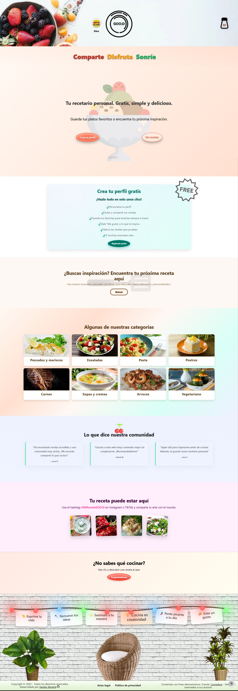

 

<h1 style="text-align: center;">GOO:D</h1>

 

<small>**ES**</small>
🎉 GOO:D es más que un recetario; es tu compañero para crear, descubrir y compartir platos con pasión y facilidad. Animado y cuidadosamente diseñado, combina lo mejor de **Django**, **JavaScript**, **SASS** y librerías modernas como **Quill** y **Select2** para ofrecer una experiencia culinaria única.

*God! Good! Go!* — Un recetario multilingüe que combina inspiración, calidad y acción para amantes de la cocina.

Además, GOO:D significa también **Comparte Disfruta Sonríe :D** — porque cocinar es todo eso.  

---

<small>**EN**</small>🎉 GOO:D is more than just a cookbook; it’s your companion to create, discover, and share dishes with passion and ease. Playful yet carefully crafted, it blends the power of **Django**, **JavaScript**, **SASS**, and modern libraries like **Quill** and **Select2** to deliver a unique culinary experience.  

*God! Good! Go!* — A multilingual recipe book that brings together inspiration, quality, and action for food lovers.  

And GOO:D also means **Share Enjoy Smile :D** — because cooking is all of that.  

 

## 📸 Capturas de pantalla  
### (Screenshots / Schermate / Captures / Képernyőképek / Capturas)

| Inicio / Home | Recetas / Recipes | Detalle receta / Recipe page |
|---------------|------------------|-------------------|
|  |  | |

| Buscador / Search | Perfil / Profile (datos / data) | Perfil / Profile (recetas /recipes) |
|------------------------------|--------------------------|----------------------------|
|   |  |  |

| Perfil / Profile (favoritas / favorites) | Perfil / Profile (comentarios / comments) | Perfil / Profile (puntuaciones / rating) |
|------------------------------|-------------------------------|---------------------------------|
|  |  |  |

## 🎥 Demo en vídeo
### (Video demo / Demo video / Demo in video / Demostració en vídeo / Videó bemutató / Demonstração em vídeo)

| 🏠 Home | 📋 Recipes | 📖 Recipe page | ✏️ Create / Update form |
|---------|------------|----------------|-------------------------|
|  |  |  |  |

---
 

🇪🇸 Español

## 🍽️ ¿Qué es GOO:D?

**GOO:D** es una plataforma web para compartir recetas, con soporte multilingüe, diseño responsivo y animaciones cuidadas. Está pensada para usuarios anónimos y registrados, ofreciendo una experiencia rica, visual y funcional.

 

### 🚀 Tecnologías usadas

- **Backend:** Django
- **Frontend:** JavaScript, SASS, AJAX
- **Interfaces ricas:** Quill, Select2 (TinyMCE para administración)
- **Traducción automática:** `LibreTranslate` 

 

### 👥 Funcionalidades por tipo de usuario

| Funcionalidad                                       | Visitantes (sin login) 👫 | Usuarios registrados 🔐 |
|-----------------------------------------------------|---------------------------|--------------------------|
| Ver recetas                                        | ✅                        | ✅                       |
| Búsqueda avanzada con filtros                      | ✅                        | ✅                       |
| Sliders temáticos de recetas                       | ✅                        | ✅                       |
| Sección sorpresa ("¿No sabes qué cocinar?")        | ✅                        | ✅                       |
| Guardar recetas favoritas                          | ❌                        | ✅                       |
| Comentar recetas                                   | ❌                        | ✅                       |
| Puntuar recetas                                    | ❌                        | ✅                       |
| Perfil con avatar y datos                          | ❌                        | ✅                       |
| Subir recetas (convertirse en autor)               | ❌                        | ✅                       |
| Editar / borrar recetas propias                    | ❌                        | ✅ (solo autores)        |

#### 🛠️ Administración
- Panel de Django Admin completo.
- Gestión de usuarios, recetas, ingredientes, categorías y más.
- Solo accesible para superusuarios.

 

### 🌍 Traducciones automáticas

- Las recetas creadas en un idioma se traducen automáticamente al resto de idiomas disponibles.  
- Para los textos de la interfaz se utiliza **Django i18n**, con soporte de **Rosetta** y **Parler**.  
- Para los campos de texto libre, las traducciones se generan mediante **LibreTranslate** en producción.
- Además, se han realizado más de 2600 traducciones manuales para garantizar calidad y naturalidad en los idiomas soportados.

 

### 🧾 Formularios detallados

Los formularios de creación/edición de recetas permiten:

- Agregar ingredientes organizados
- Redactar pasos detallados
- Elegir múltiples categorías
- Asignar tags, alérgenos, dificultad, tipo de comida, tiempo, etc.
- Tooltips en labels para guía

 

### 🎨 Interfaz y diseño
- Responsive (mobile-first)
- Animaciones y microinteracciones cuidadas
- Navegación creativa:
  - Logo: plato giratorio con mantel al hover/click
  - Utensilios como enlaces, mesa puesta como menú
- Página de lista de recetas con varias secciones:
  - Top recetas: según puntuación media
  - Recientes: por fecha de publicación
  - Favoritas: las más guardadas
  - Fáciles:nivel de dificultad "fácil"
  - Recetas de la cocina "xyz"(dinámico): del tipo de cocina con más recetas subidas
  - Recetas de actualidad (dinámico): se activan y muestran las recetas según temática (temporadas, estaciones, festividades concretas: Halloween, Navidad, Nochevieja, St. Valentin, Carnaval, Día del Padre/de la Madre, Pascua, etc.) 

- Sección especial de "Mi perfil":
  - Diseño único 
  - Secciones varias: 
    - Datos personales: datos de usuario, cambios de avatar, email o contraseña
    - Recetas subidas propias 
    - Favoritas: las recetas marcadas como favoritas y guardadas en esta sección
    - Comentarios:
      - "mis comentarios"
      - "respuestas a mis comentarios"
      - "comentarios en mis recetas"
    - Mis puntuaciones: lista de recetas valoradas por el usuario 

### 📧 Extras

- Formulario de contacto con sistema de correos
- Funcionalidad completa de login, registro y recuperación de contraseña vía email

 

> **Nota:** Este proyecto se ha creado con fines demostrativos para evaluación académica.  
> Los textos e imágenes de las recetas provienen de [Comedera](https://comedera.com) y son propiedad de sus autores.

 

## 🚀 Despliegue

El backend está desplegado en **Alwaysdata**, integrado con el frontend y con soporte multilenguaje.  
La traducción automática se realiza mediante una API externa en producción.

👉 Puedes acceder a la aplicación en:  
[https://goodgo.alwaysdata.net/](https://goodgo.alwaysdata.net/)

 

## 📫 Contacto

  
  
  

---

 

🇬🇧 English

## 🍽️ What is GOO:D?

**GOO:D** is a web platform for sharing recipes, with multilingual support, responsive design, and smooth animations. It’s designed for both anonymous and registered users, offering a rich, visual, and functional experience.

 

### 🚀 Technologies used

- **Backend:** Django  
- **Frontend:** JavaScript, SASS, AJAX  
- **Rich interfaces:** Quill, Select2 (TinyMCE for administration)  
- **Automatic translation:** `LibreTranslate`   

 

### 👥 Features by user type

| Feature                                             | Visitors (no login) 👫 | Registered users 🔐 |
|-----------------------------------------------------|-------------------------|----------------------|
| View recipes                                        | ✅                      | ✅                   |
| Advanced search with filters                        | ✅                      | ✅                   |
| Thematic recipe sliders                             | ✅                      | ✅                   |
| Surprise section ("Don’t know what to cook?")       | ✅                      | ✅                   |
| Save favorite recipes                               | ❌                      | ✅                   |
| Comment on recipes                                  | ❌                      | ✅                   |
| Rate recipes                                        | ❌                      | ✅                   |
| Profile with avatar and data                        | ❌                      | ✅                   |
| Upload recipes (become an author)                   | ❌                      | ✅                   |
| Edit / delete own recipes                           | ❌                      | ✅ (authors only)    |

#### 🛠️ Administration
- Full Django Admin panel  
- Management of users, recipes, ingredients, categories, and more  
- Accessible only to superusers  

 

### 🌍 Automatic translations

- Recipes created in one language are automatically translated into all the other available languages.  
- Interface texts are managed with **Django i18n**, supported by **Rosetta** and **Parler**.  
- Free-text fields are translated using **LibreTranslate** in production.
- In addition, over 2600 manual translations have been done to ensure quality and naturalness in all supported languages.

 

### 🧾 Detailed forms

The recipe creation/editing forms allow:  

- Adding organized ingredients  
- Writing detailed steps  
- Choosing multiple categories  
- Assigning tags, allergens, difficulty, meal type, time, etc.  
- Labels with tooltips as a guide  

 

### 🎨 Interface and design

- Responsive (mobile-first)  
- Carefully crafted animations and micro-interactions  
- Creative navigation:  
  - Logo: spinning plate with animated tablecloth on hover/click  
  - Utensils as links, table set as menu  
- Recipe list page with several sections:  
  - Top recipes: by average rating  
  - Recent: by publication date  
  - Favorites: most saved  
  - Easy: “easy” difficulty recipes  
  - Cuisine “xyz” (dynamic): cuisine type with most uploaded recipes  
  - Seasonal recipes (dynamic): activated and shown depending on theme (seasons, holidays, special events: Halloween, Christmas, New Year’s Eve, Valentine’s Day, Carnival, Mother’s/Father’s Day, Easter, etc.)  

- Special “My profile” section:  
  - Unique design  
  - Several areas:  
    - Personal data: user info, avatar, email or password changes  
    - Own uploaded recipes  
    - Favorites: recipes marked as favorites and saved in this section 
    - Comments:  
      - “my comments” 
      - “replies to my comments” 
      - “comments on my recipes” 
    - My ratings: list of recipes rated by the user  

 

### 📧 Extras

- Contact form with email system 
- Full login, registration, and password recovery via email  

> **Note:** This project was created for academic evaluation purposes.  
> The recipe texts and images come from [Comedera](https://comedera.com) and are the property of their authors.  

 

## 🚀 Deployment

The backend is deployed on **Alwaysdata**, integrated with the frontend and with multilanguage support.  
Automatic translation is handled by an external API in production.  

Access the app at:  
[https://goodgo.alwaysdata.net/](https://goodgo.alwaysdata.net/)

 

## 📫 Contact

  
  
  

---
 

🇦🇩 Català

## 🍽️ Què és GOO:D?

**GOO:D** és una plataforma web per compartir receptes, amb suport multilingüe, disseny responsive i animacions suaus. Està pensada tant per a usuaris anònims com registrats, oferint una experiència rica, visual i funcional.  

 

### 🚀 Tecnologies utilitzades

- **Backend:** Django  
- **Frontend:** JavaScript, SASS, AJAX  
- **Interfícies riques:** Quill, Select2 (TinyMCE per a l’administració)  
- **Traducció automàtica:** `LibreTranslate`  

 

### 👥 Funcionalitats segons tipus d’usuari  

| Funcionalitat                                        | Visitants (sense login) 👫 | Usuaris registrats 🔐 |
|------------------------------------------------------|----------------------------|------------------------|
| Veure receptes                                       | ✅                         | ✅                     |
| Cerca avançada amb filtres                           | ✅                         | ✅                     |
| Sliders temàtics de receptes                         | ✅                         | ✅                     |
| Secció sorpresa ("No saps què cuinar?")              | ✅                         | ✅                     |
| Guardar receptes preferides                          | ❌                         | ✅                     |
| Comentar receptes                                    | ❌                         | ✅                     |
| Valorar receptes                                     | ❌                         | ✅                     |
| Perfil amb avatar i dades                            | ❌                         | ✅                     |
| Pujar receptes (esdevenir autor)                     | ❌                         | ✅                     |
| Editar / eliminar receptes pròpies                   | ❌                         | ✅ (només autors)      |  

#### 🛠️ Administració  
- Panell complet de Django Admin.  
- Gestió d’usuaris, receptes, ingredients, categories i més.  
- Només accessible per a superusuaris.  

 

### 🌍 Traduccions automàtiques

- Les receptes creades en un idioma es tradueixen automàticament a la resta d’idiomes disponibles.
- Per als textos de la interfície s’utilitza Django i18n, amb suport de Rosetta i Parler.
- Per als camps de text lliure, les traduccions es generen amb LibreTranslate en producció.
- A més, s’han realitzat més de 2600 traduccions manuals per garantir qualitat i naturalitat en els idiomes disponibles.

 

### 🧾 Formularis detallats  

Els formularis de creació/edició de receptes permeten:  

- Afegir ingredients organitzats  
- Escriure passos detallats  
- Escollir múltiples categories  
- Assignar etiquetes, al·lèrgens, dificultat, tipus d’àpat, temps, etc.  
- Etiquetes amb tooltips com a guia  

 

### 🎨 Interfície i disseny  

- Responsive (mobile-first)  
- Animacions i microinteraccions cuidades  
- Navegació creativa:  
  - Logo: plat giratori amb estovalles animades en hover/click  
  - Estris com a enllaços, taula parada com a menú  
- Pàgina de llistat de receptes amb diverses seccions:  
  - Receptes top: per mitjana de valoracions  
  - Recents: per data de publicació  
  - Preferides: més guardades  
  - Fàcils: receptes amb dificultat “fàcil” 
  - Receptes de la Cuina “xyz” (dinàmica): tipus de cuina amb més receptes pujades  
  - Receptes d'actualitat (dinàmica): receptes activades i mostrades segons temàtica (estacions, festes, esdeveniments especials: Halloween, Nadal, Cap d’Any, Sant Valentí, Carnestoltes, Dia de la Mare/Pare, Pasqua, Pasqua etc.)  

- Secció especial “El meu perfil”:  
  - Disseny únic  
  - Diverses àrees:  
    - Dades personals: informació d’usuari, canvi d’avatar, email o contrasenya  
    - Receptes pròpies pujades  
    - Favorites: receptes marcades i guardades en aquest secció
    - Comentaris:  
      - “els meus comentaris” 
      - “respostes als meus comentaris” 
      - “comentaris a les meves receptes” 
    - Les meves valoracions: llista de receptes valorades per l’usuari  

 

### 📧 Extres  

- Formulari de contacte amb sistema d’email
- Sistema complet de login, registre i recuperació de contrasenya per email  

> **Nota:** Aquest projecte s’ha creat amb finalitats d’avaluació acadèmica.  
> Els textos i imatges de les receptes provenen de [Comedera](https://comedera.com) i són propietat dels seus autors.  

 

## 🚀 Desplegament  

El backend està desplegat a **Alwaysdata**, integrat amb el frontend i amb suport multillenguatge.  
La traducció automàtica es realitza mitjançant una API externa en producció.   

👉 Accés a l’aplicació en:  
[https://goodgo.alwaysdata.net/](https://goodgo.alwaysdata.net/)

 

## 📫 Contacte  

  
  
  

---

 

🇮🇹 Italiano

## 🍽️ Che cos’è GOO:D?

**GOO:D** è una piattaforma web per condividere ricette, con supporto multilingue, design responsive e animazioni fluide. È pensata sia per utenti anonimi sia registrati, offrendo un’esperienza ricca, visiva e funzionale.  

 

### 🚀 Tecnologie utilizzate

- **Backend:** Django  
- **Frontend:** JavaScript, SASS, AJAX  
- **Interfacce ricche:** Quill, Select2 (TinyMCE per l’amministrazione)  
- **Traduzione automatica:** `LibreTranslate`

 

### 👥 Funzionalità per tipo di utente  

| Funzionalità                                         | Visitatori (senza login) 👫 | Utenti registrati 🔐 |
|------------------------------------------------------|-----------------------------|-----------------------|
| Visualizzare ricette                                 | ✅                          | ✅                    |
| Ricerca avanzata con filtri                          | ✅                          | ✅                    |
| Slider tematici di ricette                           | ✅                          | ✅                    |
| Sezione sorpresa ("Non sai cosa cucinare?")          | ✅                          | ✅                    |
| Salvare ricette preferite                            | ❌                          | ✅                    |
| Commentare ricette                                   | ❌                          | ✅                    |
| Valutare ricette                                     | ❌                          | ✅                    |
| Profilo con avatar e dati                            | ❌                          | ✅                    |
| Caricare ricette (diventare autore)                  | ❌                          | ✅                    |
| Modificare / eliminare le proprie ricette            | ❌                          | ✅ (solo autori)      |  

#### 🛠️ Amministrazione  
- Pannello completo di Django Admin  
- Gestione di utenti, ricette, ingredienti, categorie e altro  
- Accesso riservato ai superuser  

 

### 🌍 Traduzioni automatiche

- Le ricette create in una lingua vengono tradotte automaticamente nelle altre lingue disponibili.  
- Per i testi dell’interfaccia viene utilizzato Django i18n, con il supporto di Rosetta e Parler.
- Per i campi di testo libero, le traduzioni vengono generate con LibreTranslate in produzione.
- Inoltre, sono state effettuate oltre 2600 traduzioni manuali per garantire qualità e naturalezza nelle lingue supportate.

 

### 🧾 Form dettagliati  

I form di creazione/modifica delle ricette permettono di:  

- Aggiungere ingredienti organizzati  
- Scrivere passaggi dettagliati  
- Selezionare più categorie  
- Assegnare tag, allergeni, difficoltà, tipo di pasto, tempo, ecc.  
- Tag con tooltip come guida  

 

### 🎨 Interfaccia e design  

- Responsive (mobile-first)  
- Animazioni e microinterazioni curate  
- Navigazione creativa:  
  - Logo: piatto rotante con tovaglia animata su hover/click  
  - Utensili come link, tavola apparecchiata come menù  
- Pagina elenco ricette con diverse sezioni:  
  - Ricette top: per media delle valutazioni  
  - Recenti: per data di pubblicazione  
  - Preferite: più salvate  
  - Facili: ricette con difficoltà “facile” 
  - Ricette dalla cucina “xyz” (dinamica): tipo di cucina con più ricette caricate  
  - Ricette stagionali (dinamiche): ricette attivate e mostrate in base al periodo (stagioni, feste, eventi speciali: Halloween, Natale, Capodanno, San Valentino, Carnevale, Festa della mamma/papà, Pasqua, ecc.)  

- Sezione speciale “Il mio profilo”:  
  - Design personalizzato  
  - Diverse aree:  
    - Dati personali: info utente, cambio avatar, email o password  
    - Ricette proprie caricate  
    - Preferite: Ricette contrassegnate come preferite e salvate in questa sezione    
    - Commenti:  
      - “i miei commenti” 
      - “risposte ai miei commenti” 
      - “commenti alle mie ricette” 
    - Le mie valutazioni: elenco delle ricette valutate dall’utente  

 

### 📧 Extra  

- Form di contatto con sistema email  
- Sistema completo di login, registrazione e recupero password via email  

> **Nota:** Questo progetto è stato creato per finalità di valutazione accademica.  
> I testi e le immagini delle ricette provengono da [Comedera](https://comedera.com) e sono di proprietà dei rispettivi autori.  

 

## 🚀 Deployment  

Il backend è distribuito su **Alwaysdata**, integrato con il frontend e con supporto multilingue.  
La traduzione automatica è gestita da un'API esterna in produzione.    

👉 Accesso all’applicazione:  
[https://goodgo.alwaysdata.net/](https://goodgo.alwaysdata.net/)

 

## 📫 Contatti  

  
  
  

---

 

🇭🇺 Magyar

## 🍽️ Mi az a GOO:D?

A **GOO:D** egy webes receptmegosztó platform, többnyelvű támogatással, reszponzív dizájnnal és gördülékeny animációkkal. Úgy lett kialakítva, hogy anonim és regisztrált felhasználóknak egyaránt gazdag, vizuális és funkcionális élményt nyújtson.  

 

### 🚀 Használt technológiák

- **Backend:** Django  
- **Frontend:** JavaScript, SASS, AJAX  
- **Gazdag felületek:** Quill, Select2 (TinyMCE admin felülethez)  
- **Automatikus fordítás:** `LibreTranslate` használatával

 

### 👥 Jellemzők felhasználói típus szerint

| Funkció                                              | Látogatók (bejelentkezés nélkül) 👫 | Regisztrált felhasználók 🔐 |
|------------------------------------------------------|-------------------------------------|-----------------------------|
| Receptek megtekintése                                | ✅                                  | ✅                          |
| Részletes keresés szűrőkkel                          | ✅                                  | ✅                          |
| Tematikus recept-slider                              | ✅                                  | ✅                          |
| Meglepetés szekció ("Nem tudod, mit főzz?")          | ✅                                  | ✅                          |
| Kedvencek mentése                                    | ❌                                  | ✅                          |
| Receptek kommentálása                                | ❌                                  | ✅                          |
| Receptek értékelése                                  | ❌                                  | ✅                          |
| Profil avatarral és adatokkal                        | ❌                                  | ✅                          |
| Receptek feltöltése (szerzővé válás)                 | ❌                                  | ✅                          |
| Saját receptek szerkesztése / törlése                | ❌                                  | ✅ (csak a szerző)          |  

#### 🛠️ Adminisztráció  
- Teljes Django Admin felület  
- Felhasználók, receptek, hozzávalók, kategóriák stb. kezelése  
- Hozzáférés csak szuperusereknek  

 

### 🌍 Automatikus fordítások

- Az egyik nyelven létrehozott receptek automatikusan lefordításra kerülnek a többi elérhető nyelvre.  
- A felület szövegei **Django i18n** segítségével vannak kezelve, **Rosetta** és **Parler** támogatással.  
- A szabad szöveges mezők setében a fordításokat LibreTranslate segítségével készítjük élőben.
- Ezen felül több mint 2600 kézi fordítás készült a minőség és a természetesség biztosítása érdekében az összes támogatott nyelven.

 

### 🧾 Részletes űrlapok  

A recept létrehozó/szerkesztő űrlap lehetővé teszi:  

- Hozzávalók strukturált hozzáadását  
- Lépésről lépésre történő leírást  
- Több kategória kiválasztását  
- Címkék, allergének, nehézségi szint, ételtípus, elkészítési idő stb. beállítását  
- Tooltip-es címkék használatát útmutatóként  

 

### 🎨 Felület és dizájn  

- Reszponzív (mobile-first)  
- Gondosan megtervezett animációk és mikrointerakciók  
- Kreatív navigáció:  
  - Logó: forgó tányér animált terítővel hover/kattintásra  
  - Eszközök mint linkek, megterített asztal mint menü  
- Receptek listázása különböző szekciókban:  
  - Top receptek: értékelési átlag alapján  
  - Legújabbak: feltöltési dátum szerint  
  - Kedvencek: legtöbbször elmentett receptek  
  - Könnyű: “könnyű” nehézségű receptek  
  - “xyz” konyha receptjei (dinamikus): a legtöbb receptet tartalmazó nemzetközi konyha  
  - Szezonális receptek (dinamikus): időszakhoz igazodó receptek (évszakok, ünnepek, események: Halloween, Karácsony, Szilveszter, Valentin-nap, Farsang, Anyák napja/Apák napja, Húsvét stb.)  

- Speciális “Profilom” szekció:  
  - Testreszabott dizájn  
  - Több rész:  
    - Személyes adatok: felhasználói információk, avatar, email és jelszó módosítása  
    - Saját feltöltött receptek  
    - Kedvencek: a kedvencként megjelölt és elmentett receptek, ebben a szakaszban
    - Kommentek:  
      - “saját kommentjeim” 
      - “válaszok a kommentjeimre” 
      - “kommentek a receptjeimhez” 
    - Saját értékelések: a felhasználó által értékelt receptek listája  

 

### 📧 Extrák  

- Kapcsolatfelvételi űrlap email küldéssel
- Teljes bejelentkezési, regisztrációs és jelszó-helyreállító rendszer emailen keresztül  

> **Megjegyzés:** Ez a projekt oktatási célból készült.  
> A receptek szövegei és képei a [Comedera](https://comedera.com) oldalról származnak, és a szerzők tulajdonát képezik.  

 

## 🚀 Telepítés  

A backend, frontenddel integrálva, az **Alwaysdata**-ra van telepítve, és többnyelvű támogatású.  
Az automatikus fordítást egy külső API kezeli élőben.   

👉 Alkalmazás elérése itt:  
[https://goodgo.alwaysdata.net/](https://goodgo.alwaysdata.net/)

 

## 📫 Kapcsolat  

  
  
  

---

 

🇵🇹 Português

## 🍽️ O que é o GOO:D?

O **GOO:D** é uma plataforma web para compartilhar receitas, com suporte multilíngue, design responsivo e animações fluidas.  
Foi criada para oferecer uma experiência rica, visual e funcional tanto para usuários anônimos quanto para registrados.  

 

### 🚀 Tecnologias utilizadas

- **Backend:** Django  
- **Frontend:** JavaScript, SASS, AJAX  
- **Interfaces ricas:** Quill, Select2 (TinyMCE para administração)  
- **Tradução automática:** `LibreTranslate`  

 

### 👥 Características por tipo de utilizador

| Funcionalidade                                       | Visitantes (sem login) 👫 | Usuários registrados 🔐 |
|------------------------------------------------------|---------------------------|-------------------------|
| Visualizar receitas                                  | ✅                        | ✅                      |
| Busca avançada com filtros                           | ✅                        | ✅                      |
| Slider temático de receitas                          | ✅                        | ✅                      |
| Seção surpresa ("Não sabe o que cozinhar?")          | ✅                        | ✅                      |
| Salvar favoritos                                     | ❌                        | ✅                      |
| Comentar receitas                                    | ❌                        | ✅                      |
| Avaliar receitas                                     | ❌                        | ✅                      |
| Perfil com avatar e dados                            | ❌                        | ✅                      |
| Subir receitas (ser autor)                           | ❌                        | ✅                      |
| Editar / excluir próprias receitas                   | ❌                        | ✅ (apenas o autor)     |  

#### 🛠️ Administração  
- Painel completo do Django Admin  
- Gestão de usuários, receitas, ingredientes, categorias etc.  
- Acesso exclusivo para superusuários  

 

### 🌍 Traduções automáticas

- As receitas criadas em um idioma são traduzidas automaticamente para os outros idiomas disponíveis.
- Para os textos da interface utiliza-se Django i18n, com suporte de Rosetta e Parler.
- Para os campos de texto livre, as traduções são geradas com LibreTranslate em produção.
- Além disso, foram realizadas mais de 2500 traduções manuais para garantir qualidade e naturalidade em todos os idiomas suportados.

 

### 🧾 Formulários detalhados  

O formulário de criação/edição de receitas permite:  

- Adicionar ingredientes de forma estruturada  
- Escrever passo a passo  
- Selecionar múltiplas categorias  
- Definir tags, alergênicos, nível de dificuldade, tipo de prato, tempo etc.  
- Usar tooltips nas tags como guia  

 

### 🎨 Interface e design  

- Responsivo (mobile-first)  
- Animações e microinterações cuidadosamente trabalhadas  
- Navegação criativa:  
  - Logotipo: prato giratório com toalha animada ao passar/clicar  
  - Utensílios como links, mesa posta como menu  
- Listagem de receitas em várias seções:  
  - Top receitas: por média de avaliações  
  - Mais recentes: por data de publicação  
  - Favoritas: mais salvas pelos usuários  
  - Fáceis: classificadas como “fáceis” 
  - Receitas de la cozinha “xyz” (dinâmica): cozinha internacional com mais receitas  
  - Receitas sazonais (dinâmicas): receitas adaptadas ao calendário (estações, feriados e eventos: Halloween, Natal, Ano Novo, Dia dos Namorados, Carnaval, Dia das Mães/Pais, Páscoa etc.)  

- Seção especial “Meu Perfil”:  
  - Design personalizado  
  - Dividida em várias partes:  
    - Dados pessoais: informações do usuário, avatar, alteração de email e senha  
    - Minhas receitas publicadas  
    - Favoritos: receitas marcadas como favoritas e salvas nesta seção
    - Comentários:  
      - “meus comentários” 
      - “respostas aos meus comentários” 
      - “comentários nas minhas receitas” 
    - Minhas avaliações: lista de receitas avaliadas pelo usuário  

 

### 📧 Extras  

- Formulário de contato com envio por email
- Sistema completo de login, registro e recuperação de senha via email  

> **Nota:** Este projeto foi desenvolvido para fins educacionais.  
> Os textos e imagens das receitas foram extraídos de [Comedera](https://comedera.com) e pertencem aos seus respectivos autores.  

 

## 🚀 Implantação  

O backend está implantado no **Alwaysdata**, integrado com o frontend e com suporte multilíngue.  
A tradução automática é feita por uma API externa em produção.  

👉 Acesse a aplicação:  
[https://goodgo.alwaysdata.net/](https://goodgo.alwaysdata.net/)

 

## 📫 Contato  

  
  
  

---

